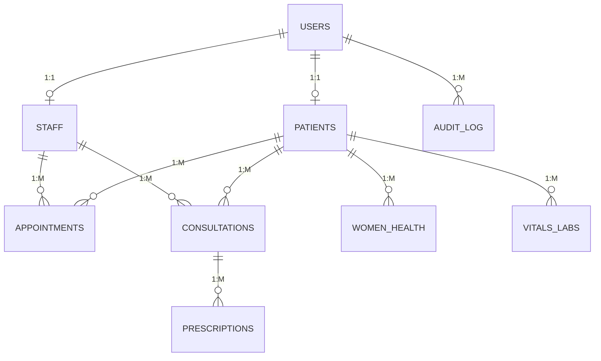

# Health Management System (HMS): Build Specification

> **Audience:** an autonomous coding agent. Build the whole project from this file.
> **Source:** a final-year project, *"Design and Implementation of a Health Management System"* (Chapters 1 to 3). This spec keeps the document's **entities, relationships, roles, modules and workflow**, and replaces its **tech stack** (Django/MySQL/Bootstrap) because this build is a **demo**.

---

## 0. How to work

1. **Follow the stack in section 1 exactly.** Do not substitute frameworks, ORMs or databases.
2. **Keep the entity relationships in section 5.** Field additions are allowed; removing or re-wiring the core entities is not.
3. **Verify library APIs against current docs before coding** (Next.js, Prisma, Better Auth). Their APIs change between versions. Where this spec and the current docs disagree on *syntax*, follow the docs. Where they disagree on *behaviour or architecture*, follow this spec and note the deviation in `DECISIONS.md`.
4. **Work in the phases in section 14.** Each phase has acceptance checks. Make sure the app builds and runs at the end of each phase. Commit after each phase.
5. Keep a short `DECISIONS.md` for anything ambiguous or any deviation.
6. This is a **demo**. Prefer working and clear over exhaustive. Do not build anything listed under "Out of scope" (section 13).

---

## 1. Tech stack (mandatory)

| Concern | Choice |
|---|---|
| Framework | **Next.js** (latest stable), **App Router**, TypeScript (strict) |
| ORM | **Prisma 6.x** (pin `prisma` and `@prisma/client` to `^6`) |
| Database | **MongoDB** (Prisma `mongodb` provider) |
| Auth | **Better Auth** (`better-auth`) with the **Prisma adapter** (`provider: "mongodb"`), email + password |
| UI | Tailwind CSS + shadcn/ui, lucide-react icons, responsive (mobile-first) |
| Forms / validation | react-hook-form + **zod** (shared schemas for client and server) |
| Charts (reports) | recharts |
| Dates | date-fns |
| Package manager | pnpm (npm is fine if pnpm is unavailable) |

**Why Prisma 6 and not newer:** MongoDB support is a Prisma 6 feature set. Confirm in the Prisma docs that the version you install supports the `mongodb` provider before proceeding.

**MongoDB must run as a replica set.** Prisma needs this for transactions and nested writes on MongoDB. Provide a `docker-compose.yml` that starts a single-node replica set (or instruct use of a free MongoDB Atlas cluster, which is a replica set already). Document whichever you choose in the README.

---

## 2. What the system is

A web-based health management system for a small/medium clinic. It handles day-to-day administration and clinical records and has a **women's health follow-up module** (cycle records, antenatal visits, blood-pressure alerts). Every record write runs through **validation, save, risk-alert rules, audit log, then notification**.

### Roles

| Role value (stored lowercase) | Who | Summary |
|---|---|---|
| `patient` | Patient / woman user | Books own appointments, logs own readings, views own records |
| `doctor` | Doctor | Full clinical access: consultations, prescriptions, order and read labs |
| `nurse` | Nurse | Records vitals, women's health data, manages appointments; **cannot prescribe** |
| `receptionist` | Receptionist / records officer | Registers patients, manages appointments; **no clinical details** |
| `admin` | System administrator | Manages staff/users, alert rules, reports, audit log; **no clinical record access** |

`doctor`, `nurse` and `receptionist` are collectively "staff" (they have a `Staff` row).

---

## 3. Architecture (maps to the document's three tiers)

The document describes a three-tier design. Map it onto Next.js like this:

| Document tier | Implementation |
|---|---|
| Tier 1: Presentation (Login/Registration, Patient Dashboard, Appointment Booking, Clinical Forms) | `app/` pages and components (React Server Components + client components for forms) |
| Tier 2: Application / business logic (8 modules) | `src/modules/*` service functions, called by **Server Actions** and a few **Route Handlers**. Pages and actions never call Prisma directly for writes; they call a module service. |
| Tier 3: Data (DB, backup store, audit log) | MongoDB via Prisma; `AuditLog` collection. (Backup store is out of scope; see section 13.) |
| External SMS/Email gateway | `NotificationProvider` interface with a **console/mock** implementation (section 9) |

### The eight application modules (one folder each under `src/modules/`)

1. `auth`: Better Auth config, session helpers, role guards (RBAC)
2. `patients`: patient records manager
3. `appointments`: scheduler (double-booking prevention, status transitions)
4. `clinical`: consultations, prescriptions, vitals and lab results
5. `womens-health`: cycle, antenatal and BP records
6. `alerts`: risk alert engine (rule evaluation)
7. `notifications`: notification service (in-app + mock email/SMS)
8. `reports`: reports and analytics

Plus a cross-cutting `audit` helper used by all modules.

### Suggested structure

```
.
├─ prisma/
│  ├─ schema.prisma
│  └─ seed.ts
├─ src/
│  ├─ app/
│  │  ├─ (public)/            login, register, forgot-password, reset-password
│  │  ├─ onboarding/          patient profile completion after self sign-up
│  │  ├─ (app)/               authenticated shell (sidebar by role)
│  │  │  ├─ dashboard/
│  │  │  ├─ patients/         list, new, [id] (tabs: overview, consultations, vitals/labs, women's health, appointments)
│  │  │  ├─ appointments/
│  │  │  ├─ consultations/[id]/
│  │  │  ├─ my/               patient self-service (appointments, readings, records, women's health)
│  │  │  ├─ alerts/
│  │  │  ├─ notifications/
│  │  │  ├─ reports/
│  │  │  └─ admin/            users, alert-rules, audit-log
│  │  └─ api/
│  │     ├─ auth/[...all]/route.ts
│  │     └─ cron/reminders/route.ts
│  ├─ lib/                    prisma.ts, auth.ts, auth-client.ts, rbac.ts, validation ranges
│  ├─ modules/                the eight modules + audit
│  └─ components/             ui/ (shadcn), layout/, forms/, tables/
├─ docker-compose.yml
├─ .env.example
├─ DECISIONS.md
└─ README.md
```

---

## 4. Authentication with Better Auth (integrated with the database)

### 4.1 Approach

- Use Better Auth with `prismaAdapter(prisma, { provider: "mongodb" })` from `better-auth/adapters/prisma`.
- **Email + password** only. Passwords are hashed by Better Auth (the document's `password_hash`; see 4.3).
- Add Better Auth's **Next.js integration**: route handler at `app/api/auth/[...all]/route.ts` using `toNextJsHandler(auth)`, and the `nextCookies()` plugin (must be **last** in the plugins array) so server actions can set cookies.
- Server-side session: `auth.api.getSession({ headers: await headers() })`. Client: `createAuthClient()` with `inferAdditionalFields<typeof auth>()`.
- **Do real authorization checks server-side in every page, server action and route handler.** Edge middleware / proxy may be used for a cheap "is there a session cookie" redirect, but it is **not** the security boundary.

### 4.2 Role on the user

Add a `role` field to the Better Auth user via `user.additionalFields`:

```ts
user: {
  additionalFields: {
    role: { type: "string", required: true, defaultValue: "patient", input: false },
    isActive: { type: "boolean", required: true, defaultValue: true, input: false },
  },
},
```

`input: false` is essential: a client must never be able to set its own role at sign-up.

### 4.3 Mapping the document's USERS entity

| Document `USERS` field | Where it lives now |
|---|---|
| `user_id` (PK) | `User.id` (ObjectId) |
| `username` | Not used; **email is the login identifier** (`User.email`). `User.name` holds the display name. |
| `password_hash` | Better Auth's `Account.password` (row with `providerId: "credential"`). Never hand-roll hashing in app code. |
| `role` | `User.role` (additional field above) |
| `email` | `User.email` |

### 4.4 Account creation flows

1. **Patient self sign-up** (`/register`): name, email, password via Better Auth `signUp.email`. Role is forced to `patient` by the default. After sign-up, redirect to `/onboarding` to create the `Patient` profile (gender, date of birth, phone, etc.). Until a `Patient` row exists, the patient is redirected to `/onboarding` from anywhere in the app.
2. **Receptionist registers a walk-in patient** (`/patients/new`): the server action (after verifying role is `receptionist` or `admin`) creates the `User` + credential `Account` + `Patient` **in one Prisma transaction**, with a generated temporary password shown **once** on screen (and sent through the mock notification provider).
3. **Admin creates staff** (`/admin/users/new`): same mechanism, creates `User` (role `doctor` | `nurse` | `receptionist` | `admin`) + credential `Account` + `Staff` row (for the first three roles).

For flows 2 and 3, hash the temporary password with Better Auth's own helper (`hashPassword` from `better-auth/crypto`) and write the `Account` row yourself (`providerId: "credential"`, `accountId` = the user's id, `password` = hash). This avoids the side-effect of `signUpEmail` creating a session for the new user and logging the receptionist/admin out of their own session. The same helper is used in `prisma/seed.ts`.

> **Verify:** after implementing, sign in with a user created by flow 2 or 3 to prove Better Auth accepts the hand-written credential account. If the current Better Auth version needs a different account shape, adapt it and note it in `DECISIONS.md`.

### 4.5 Account status

`User.isActive = false` must block sign-in. Implement with a `databaseHooks.session.create.before` hook (or equivalent supported mechanism) that rejects session creation for inactive users, and delete their existing sessions when an admin deactivates them.

### 4.6 Password reset (workflow: "show error; retry / reset")

Enable `emailAndPassword.sendResetPassword`, delivering the link through the same `NotificationProvider` (console in dev). Pages: `/forgot-password`, `/reset-password`.

### 4.7 Database integration with MongoDB: the part that usually breaks

Better Auth needs four models: `User`, `Session`, `Account`, `Verification`. With Prisma + MongoDB:

- IDs must be `String @id @default(auto()) @map("_id") @db.ObjectId`.
- **Every foreign key that points to an id must be `@db.ObjectId`**, including `Session.userId`, `Account.userId`, and all of this project's `userId`, `patientId`, `staffId` fields.
- Run the Better Auth CLI (`npx @better-auth/cli generate`) against the final `auth.ts` to see exactly which fields and ID handling the installed version expects for Prisma/MongoDB, and **reconcile the four auth models in `schema.prisma` with the CLI output**. For those four models the CLI output wins; the domain models in section 5 are unchanged.
- Check Better Auth's current Prisma/MongoDB guidance on ID generation (the `advanced.database.generateId` option, or the equivalent in your installed version) so that IDs are created by MongoDB as ObjectIds rather than as non-ObjectId strings. Mismatched ID types are the most common failure here.
- Use `@@map` to give the auth collections lowercase names (`user`, `session`, `account`, `verification`) as Better Auth expects.

**Smoke test that must pass at the end of Phase 1:** register a user, then inspect MongoDB: the `user` document has an ObjectId `_id`, `role: "patient"`, a matching `account` document with a hashed password, and a `session` document. Then create a `Patient` linked via `userId` and read it back with `include: { user: true }`.

### 4.8 Hardening (cheap, do it)

- Better Auth rate limiting enabled; stricter on `/sign-in/*`.
- Secure cookies in production; `BETTER_AUTH_SECRET` from env (never committed).
- Passwords: minimum 8 characters.
- Sessions: reasonable expiry (e.g. 7 days) with sliding refresh.

---

## 5. Data model (Prisma + MongoDB)

### 5.1 Entity relationship diagram (kept from the document's Figure 3.3)



The nine core entities are **USERS, PATIENTS, STAFF, APPOINTMENTS, CONSULTATIONS, PRESCRIPTIONS, WOMEN_HEALTH, VITALS_LABS, AUDIT_LOG**. Cardinalities: USERS 1:1 PATIENTS, USERS 1:1 STAFF, USERS 1:M AUDIT_LOG, PATIENTS 1:M (APPOINTMENTS, CONSULTATIONS, WOMEN_HEALTH, VITALS_LABS), STAFF 1:M (APPOINTMENTS, CONSULTATIONS), CONSULTATIONS 1:M PRESCRIPTIONS.

A user is either a patient or staff, never both. Enforce this in the service layer.

### 5.2 Name mapping (document to Prisma)

| Document entity / field | Prisma model / field |
|---|---|
| USERS | `User` (Better Auth) |
| PATIENTS (`patient_id`, `full_name`, `date_of_birth`) | `Patient` (`id`, `fullName`, `dateOfBirth`) |
| STAFF (`staff_id`, `specialty`, `department`) | `Staff` (`id`, `specialty`, `department`) |
| APPOINTMENTS (`appt_id`, `appt_date`, `status`) | `Appointment` (`id`, `scheduledAt`, `status`) |
| CONSULTATIONS (`visit_id`, `visit_date`, `diagnosis`) | `Consultation` (`id`, `visitDate`, `diagnosis`) |
| PRESCRIPTIONS (`rx_id`, `drug_name`, `dosage`, `duration`) | `Prescription` (`id`, `drugName`, `dosage`, `duration`) |
| WOMEN_HEALTH (`record_id`, `cycle_start`, `pregnancy_week`, `bp_reading`) | `WomenHealthRecord` (`id`, `cycleStart`, `pregnancyWeek`, `bpSystolic` + `bpDiastolic`) |
| VITALS_LABS (`entry_id`, `temperature`, `weight`, `lab_result`) | `VitalsLabEntry` (`id`, `temperature`, `weight`, `labResult`, plus fields from Table 3.2) |
| AUDIT_LOG (`log_id`, `action`, `timestamp`) | `AuditLog` (`id`, `action`, `timestamp`) |

`bp_reading` is split into two integers so alert rules can compare each number.

### 5.3 Supporting models (additions, not part of the original ER)

The document's modules require these, but its ER diagram omits them. They are additive and do not change any core relationship:

- `AlertRule`: configurable thresholds (the document says an admin can change thresholds without code changes)
- `Alert`: raised risk alerts
- `Notification`: in-app notification feed and delivery log

### 5.4 `prisma/schema.prisma`

Use this as the starting point. Reconcile the four Better Auth models with the CLI output (section 4.7).

```prisma
generator client {
  provider = "prisma-client-js"
}

datasource db {
  provider = "mongodb"
  url      = env("DATABASE_URL")
}

// ───────────── Enums ─────────────
enum Gender            { FEMALE MALE OTHER }
enum AppointmentStatus { SCHEDULED CONFIRMED COMPLETED CANCELLED MISSED }
enum EntryType         { VITALS LAB }
enum LabStatus         { ORDERED COMPLETED }
enum EntrySource       { STAFF PATIENT }
enum WomenRecordType   { CYCLE ANTENATAL POSTNATAL OTHER }
enum Severity          { INFO HIGH CRITICAL }
enum AlertStatus       { OPEN ACKNOWLEDGED RESOLVED }
enum AlertSource       { VITALS WOMEN_HEALTH }
enum RuleOperator      { GTE LTE }
enum NotifChannel      { IN_APP EMAIL SMS }
enum NotifStatus       { PENDING SENT FAILED }

// ───────────── Better Auth models (reconcile with CLI output) ─────────────
model User {
  id            String    @id @default(auto()) @map("_id") @db.ObjectId
  name          String
  email         String    @unique
  emailVerified Boolean   @default(false)
  image         String?
  role          String    @default("patient")  // patient | doctor | nurse | receptionist | admin
  isActive      Boolean   @default(true)
  createdAt     DateTime  @default(now())
  updatedAt     DateTime  @updatedAt

  sessions      Session[]
  accounts      Account[]

  // Domain relations
  patient       Patient?
  staff         Staff?
  auditLogs     AuditLog[]
  notifications Notification[]

  @@map("user")
}

model Session {
  id        String   @id @default(auto()) @map("_id") @db.ObjectId
  expiresAt DateTime
  token     String   @unique
  ipAddress String?
  userAgent String?
  userId    String   @db.ObjectId
  user      User     @relation(fields: [userId], references: [id], onDelete: Cascade)
  createdAt DateTime @default(now())
  updatedAt DateTime @updatedAt

  @@map("session")
}

model Account {
  id                    String    @id @default(auto()) @map("_id") @db.ObjectId
  accountId             String
  providerId            String
  userId                String    @db.ObjectId
  user                  User      @relation(fields: [userId], references: [id], onDelete: Cascade)
  accessToken           String?
  refreshToken          String?
  idToken               String?
  accessTokenExpiresAt  DateTime?
  refreshTokenExpiresAt DateTime?
  scope                 String?
  password              String?   // Better Auth stores the password hash here
  createdAt             DateTime  @default(now())
  updatedAt             DateTime  @updatedAt

  @@map("account")
}

model Verification {
  id         String   @id @default(auto()) @map("_id") @db.ObjectId
  identifier String
  value      String
  expiresAt  DateTime
  createdAt  DateTime @default(now())
  updatedAt  DateTime @updatedAt

  @@map("verification")
}

// ───────────── Core domain (from the ER diagram) ─────────────
model Patient {
  id             String   @id @default(auto()) @map("_id") @db.ObjectId
  patientNumber  String   @unique            // human-readable, e.g. HMS-000123
  userId         String   @unique @db.ObjectId   // 1:1 with User
  user           User     @relation(fields: [userId], references: [id], onDelete: Cascade)

  // Demographic
  fullName       String
  gender         Gender
  dateOfBirth    DateTime
  phone          String?
  address        String?
  nextOfKinName  String?
  nextOfKinPhone String?

  // Medical history
  bloodGroup      String?
  allergies       String[]
  knownConditions String[]
  familyHistory   String?

  // Lifestyle
  smokingStatus    String?
  alcoholUse       String?
  physicalActivity String?
  dietNotes        String?

  createdAt DateTime @default(now())
  updatedAt DateTime @updatedAt

  appointments  Appointment[]
  consultations Consultation[]
  womenHealth   WomenHealthRecord[]
  vitalsLabs    VitalsLabEntry[]
  alerts        Alert[]
}

model Staff {
  id         String  @id @default(auto()) @map("_id") @db.ObjectId
  userId     String  @unique @db.ObjectId    // 1:1 with User
  user       User    @relation(fields: [userId], references: [id], onDelete: Cascade)
  fullName   String
  specialty  String?
  department String?
  phone      String?

  createdAt DateTime @default(now())
  updatedAt DateTime @updatedAt

  appointments  Appointment[]
  consultations Consultation[]
}

model Appointment {
  id          String            @id @default(auto()) @map("_id") @db.ObjectId
  patientId   String            @db.ObjectId
  patient     Patient           @relation(fields: [patientId], references: [id], onDelete: Cascade)
  staffId     String            @db.ObjectId
  staff       Staff             @relation(fields: [staffId], references: [id])
  scheduledAt DateTime          // start of a 30-minute slot
  reason      String?
  status      AppointmentStatus @default(SCHEDULED)
  reminderSentAt DateTime?
  createdAt   DateTime          @default(now())
  updatedAt   DateTime          @updatedAt

  @@index([patientId])
  @@index([staffId, scheduledAt])
}

model Consultation {
  id        String   @id @default(auto()) @map("_id") @db.ObjectId
  patientId String   @db.ObjectId
  patient   Patient  @relation(fields: [patientId], references: [id], onDelete: Cascade)
  staffId   String   @db.ObjectId
  staff     Staff    @relation(fields: [staffId], references: [id])
  visitDate DateTime @default(now())
  complaint String?
  diagnosis String
  notes     String?
  createdAt DateTime @default(now())
  updatedAt DateTime @updatedAt

  prescriptions Prescription[]

  @@index([patientId, visitDate])
}

model Prescription {
  id             String       @id @default(auto()) @map("_id") @db.ObjectId
  consultationId String       @db.ObjectId   // FK "visit_id"
  consultation   Consultation @relation(fields: [consultationId], references: [id], onDelete: Cascade)
  drugName       String
  dosage         String
  duration       String
  instructions   String?
  createdAt      DateTime     @default(now())
}

model WomenHealthRecord {
  id               String          @id @default(auto()) @map("_id") @db.ObjectId
  patientId        String          @db.ObjectId
  patient          Patient         @relation(fields: [patientId], references: [id], onDelete: Cascade)
  recordType       WomenRecordType @default(CYCLE)
  recordedAt       DateTime        @default(now())
  source           EntrySource     @default(STAFF)

  // Cycle
  cycleStart       DateTime?
  cycleLength      Int?            // days

  // Maternal
  gravidity        Int?
  parity           Int?
  pregnancyWeek    Int?            // gestational age in weeks
  antenatalVisitDate DateTime?

  // Blood pressure (document's bp_reading, split)
  bpSystolic       Int?
  bpDiastolic      Int?

  notes            String?
  createdAt        DateTime        @default(now())

  @@index([patientId, recordedAt])
}

model VitalsLabEntry {
  id          String      @id @default(auto()) @map("_id") @db.ObjectId
  patientId   String      @db.ObjectId
  patient     Patient     @relation(fields: [patientId], references: [id], onDelete: Cascade)
  entryType   EntryType   @default(VITALS)
  source      EntrySource @default(STAFF)
  recordedAt  DateTime    @default(now())
  recordedByUserId String? @db.ObjectId     // who entered it (patient or staff user)

  // Vitals (units: °C, bpm, mmHg, kg, cm, mmol/L)
  temperature Float?
  pulse       Int?
  bpSystolic  Int?
  bpDiastolic Int?
  weight      Float?
  height      Float?
  bloodSugar  Float?

  // Lab
  testName    String?
  labResult   String?
  labRemarks  String?
  labStatus   LabStatus?                      // set only when entryType = LAB
  orderedByStaffId String? @db.ObjectId

  createdAt   DateTime    @default(now())

  @@index([patientId, recordedAt])
}

model AuditLog {
  id         String   @id @default(auto()) @map("_id") @db.ObjectId
  userId     String?  @db.ObjectId           // null only for system actions
  user       User?    @relation(fields: [userId], references: [id])
  action     String                          // e.g. "PATIENT_VIEW", "CONSULTATION_CREATE"
  entity     String?                         // e.g. "Patient"
  entityId   String?
  details    Json?
  ipAddress  String?
  timestamp  DateTime @default(now())

  @@index([userId, timestamp])
  @@index([entity, entityId])
}

// ───────────── Supporting models (additions) ─────────────
model AlertRule {
  id        String       @id @default(auto()) @map("_id") @db.ObjectId
  code      String       @unique       // e.g. BP_SYS_HIGH
  label     String
  metric    String       // bpSystolic | bpDiastolic | temperature | pulse | bloodSugar
  operator  RuleOperator
  threshold Float
  severity  Severity
  enabled   Boolean      @default(true)
  updatedAt DateTime     @updatedAt
}

model Alert {
  id             String      @id @default(auto()) @map("_id") @db.ObjectId
  patientId      String      @db.ObjectId
  patient        Patient     @relation(fields: [patientId], references: [id], onDelete: Cascade)
  sourceType     AlertSource
  sourceId       String      @db.ObjectId
  ruleCode       String
  severity       Severity
  message        String
  status         AlertStatus @default(OPEN)
  acknowledgedByUserId String? @db.ObjectId
  createdAt      DateTime    @default(now())
  resolvedAt     DateTime?

  @@index([status, createdAt])
  @@index([patientId])
}

model Notification {
  id          String       @id @default(auto()) @map("_id") @db.ObjectId
  userId      String       @db.ObjectId
  user        User         @relation(fields: [userId], references: [id], onDelete: Cascade)
  channel     NotifChannel @default(IN_APP)
  type        String       // APPOINTMENT_REMINDER | RISK_ALERT | ACCOUNT | SYSTEM
  title       String
  body        String
  status      NotifStatus  @default(PENDING)
  readAt      DateTime?
  relatedType String?
  relatedId   String?
  createdAt   DateTime     @default(now())
  sentAt      DateTime?

  @@index([userId, readAt])
}
```

### 5.5 Mongo-specific notes

- No database-level cascade guarantees in the way SQL has; Prisma emulates referential actions (`onDelete: Cascade`). Keep deletes rare. Prefer soft states (`CANCELLED`, `isActive = false`) over hard deletes for clinical data.
- Multi-document writes (e.g. create User + Account + Patient) must use `prisma.$transaction`.
- Run `prisma db push` for schema sync (Prisma migrations are not used with MongoDB).

---

## 6. Authorization (RBAC)

Implement one central module `src/lib/rbac.ts` exporting:

- `requireSession()`: returns the session or redirects to `/login`
- `requireRole(...roles)`: returns the session or throws/redirects (403 page)
- `can(role, permission)`: pure function over the matrix below
- `assertPatientOwnership(session, patientId)`: for `patient` role, the `patientId` must belong to their own `Patient` row

Every server action and page calls these. Never trust a `patientId` from the client for a `patient` user: always derive it from the session.

### Permission matrix

| Capability | patient | doctor | nurse | receptionist | admin |
|---|:-:|:-:|:-:|:-:|:-:|
| Complete own profile / view own data | ✔ | | | | |
| Register patient | | | | ✔ | ✔ |
| View patient demographics | own | ✔ | ✔ | ✔ | |
| View clinical record (consultations, vitals, labs, women's health) | own | ✔ | ✔ | ✘ | ✘ |
| Book / reschedule / cancel appointments | own | ✔ | ✔ | ✔ | |
| Set appointment status (confirm, complete, missed) | | ✔ | ✔ | ✔ | |
| Create consultation | | ✔ | | | |
| Create prescription | | ✔ | | | |
| Order lab test | | ✔ | | | |
| Enter lab result | | ✔ | ✔ | | |
| Record vitals | own (as `PATIENT` source) | ✔ | ✔ | | |
| Record women's health data | own (as `PATIENT` source) | ✔ | ✔ | | |
| View / acknowledge / resolve alerts | own (view only) | ✔ | ✔ | | |
| View reports | | ✔ (clinical) | | ✔ (appointments) | ✔ (all) |
| Manage users and staff | | | | | ✔ |
| Edit alert rules | | | | | ✔ |
| View audit log | | | | | ✔ |

Women's health data is only recorded for patients with `gender = FEMALE`; reject otherwise.

---

## 7. Functional requirements and business rules

### 7.1 Patients (`modules/patients`)
- `patientNumber` auto-generated sequentially (`HMS-000001`…), unique.
- Search by name, phone or patient number; paginated list.
- Duplicate guard: warn when a new registration matches an existing name + date of birth + phone.
- Patient detail page with tabs: Overview, Consultations, Vitals & Labs, Women's Health, Appointments, Alerts. Tabs a role is not allowed to see are not rendered.

### 7.2 Appointments (`modules/appointments`)
- 30-minute slots; working hours 08:00 to 17:00, Monday to Saturday (constants in one config file).
- **No double booking:** a staff member cannot have two non-cancelled appointments at the same `scheduledAt`. Check inside a transaction. Return a friendly error.
- Booking in the past is rejected.
- Status transitions: `SCHEDULED → CONFIRMED → COMPLETED`; `SCHEDULED/CONFIRMED → CANCELLED`; `SCHEDULED/CONFIRMED → MISSED` (staff, only after the scheduled time). Reject any other transition.
- Reschedule = change `scheduledAt` (and optionally staff) with the same clash check.
- Patients see only their own and can book, reschedule and cancel only `SCHEDULED/CONFIRMED` ones that are in the future.
- Booking and cancelling create notifications (7.8).

### 7.3 Consultations and prescriptions (`modules/clinical`)
- Doctor creates a consultation for a patient (complaint, diagnosis, notes). Optional link: completing the consultation marks a related appointment `COMPLETED`.
- A consultation can have **many prescriptions** (drug, dosage, duration, instructions). Add/remove while the consultation is the doctor's own and less than 24 hours old; after that, read-only (append a new consultation instead).
- Patients can read their own consultations and prescriptions, read-only.

### 7.4 Vitals and labs (`modules/clinical`)
- One `VitalsLabEntry` per recording. `entryType = VITALS` carries the vitals fields; `entryType = LAB` carries test name/result/remarks and a `labStatus`.
- A doctor **orders** a test (`labStatus = ORDERED`, no result yet); doctor or nurse **completes** it by entering the result (`COMPLETED`).
- Patients can log their own vitals (`source = PATIENT`); these go through exactly the same validation and alert rules.
- Display a trend chart per vital (recharts) on the patient's Vitals tab.

### 7.5 Women's health (`modules/womens-health`)
- Record types: `CYCLE` (cycle start, length), `ANTENATAL` (gravidity, parity, gestational week, visit date, BP), `POSTNATAL`, `OTHER`.
- Show a timeline of records, the next expected cycle (cycle start + average length) and, for antenatal patients, the gestational week and a list of antenatal visits.
- A BP entered here **also triggers the alert engine** (7.6).
- Patient self-service page `/my/womens-health` for logging cycle dates and BP.

### 7.6 Risk alert engine (`modules/alerts`)
- Pure, unit-testable function: `evaluateReading(reading, rules) → TriggeredAlert[]`.
- Runs after every successful save of a `VITALS` entry or a `WomenHealthRecord` that has BP.
- Rules are **data** (`AlertRule` collection), editable by `admin` at `/admin/alert-rules`. Seed these **demo defaults**:

| code | metric | operator | threshold | severity |
|---|---|---|---|---|
| `BP_SYS_HIGH` | bpSystolic | GTE | 140 | HIGH |
| `BP_DIA_HIGH` | bpDiastolic | GTE | 90 | HIGH |
| `BP_SYS_SEVERE` | bpSystolic | GTE | 160 | CRITICAL |
| `BP_DIA_SEVERE` | bpDiastolic | GTE | 110 | CRITICAL |
| `TEMP_HIGH` | temperature | GTE | 38.0 | HIGH |
| `TEMP_LOW` | temperature | LTE | 35.0 | HIGH |
| `PULSE_HIGH` | pulse | GTE | 120 | HIGH |
| `PULSE_LOW` | pulse | LTE | 50 | HIGH |
| `GLUCOSE_HIGH` | bloodSugar | GTE | 11.1 | HIGH |

- The document's stated primary rule is **BP ≥ 140/90 mmHg flags an alert**. Keep that exactly. The other thresholds are placeholders for the demo; show a visible note in the admin UI: *"Demo thresholds. Not clinical guidance."*
- If several rules fire for the same reading and metric, keep only the highest severity per metric to avoid noise.
- Alerts store a human-readable `message` that states *why* it fired (e.g. "Systolic 152 mmHg is at or above 140 mmHg"). The document stresses that clinicians must be able to understand why a flag was raised.
- For a `WomenHealthRecord` with `recordType = ANTENATAL` and `pregnancyWeek >= 20`, **raise severity by one level** for BP rules (HIGH → CRITICAL) and say so in the message.
- Alert lifecycle: `OPEN → ACKNOWLEDGED → RESOLVED` by doctor/nurse. `/alerts` lists open alerts, sorted by severity then time. The dashboard shows an open-alerts counter.
- When an alert fires: create in-app notifications for the patient and for all active doctors and nurses.

### 7.7 Audit log (`modules/audit`)
A helper `audit({ userId, action, entity, entityId, details?, ip? })` called by **every** service function that reads a patient's clinical record or creates/updates/deletes anything. At minimum log:
`LOGIN`, `LOGOUT` (via Better Auth hooks if feasible), `PATIENT_CREATE`, `PATIENT_VIEW`, `PATIENT_UPDATE`, `APPOINTMENT_*`, `CONSULTATION_*`, `PRESCRIPTION_*`, `VITALS_CREATE`, `LAB_*`, `WOMEN_HEALTH_*`, `ALERT_*`, `USER_CREATE`, `USER_DEACTIVATE`, `ALERT_RULE_UPDATE`.
The audit log is append-only: no update or delete code paths. `/admin/audit-log` has filters (user, action, entity, date range) and pagination.

### 7.8 Notifications (`modules/notifications`)
- `NotificationProvider` interface: `send({ channel, to, title, body }) → Promise<void>`.
- Implementations: `InAppProvider` (just persists), `ConsoleProvider` (logs email/SMS to the server console and marks the row `SENT`). Wire `ConsoleProvider` as default; the interface is where Resend/Termii/Twilio would plug in later. Choose by env var `NOTIFICATION_PROVIDER=console`.
- Types: `APPOINTMENT_REMINDER`, `RISK_ALERT`, `ACCOUNT` (temp password, reset link), `SYSTEM`.
- `/notifications` page with unread badge in the header; mark one / all as read.
- **Reminders:** `GET /api/cron/reminders` finds appointments in the next 24 hours with no `reminderSentAt`, creates notifications (EMAIL + IN_APP) and sets `reminderSentAt`. Protect with a `CRON_SECRET` bearer token. Also provide a button in `/admin` to trigger it manually for the demo.
- A missed-appointment sweep (also in the cron route): appointments still `SCHEDULED/CONFIRMED` more than 2 hours past their time become `MISSED`, and the patient gets a follow-up notification.

### 7.9 Reports (`modules/reports`)
Charts and tables with a month range filter:
- Patients seen per month (distinct patients with a consultation)
- Appointments by status, and missed-appointment rate
- Top 10 diagnoses
- Antenatal records per month
- Alerts by severity, and open vs resolved
- Visible by role per the matrix (aggregate numbers only; reports never list clinical details for the `admin` role).
- CSV export for each table.

### 7.10 Dashboards (landing page per role)
- **patient:** upcoming appointments, latest vitals, recent prescriptions, unread notifications, quick actions (book appointment, log reading).
- **doctor / nurse:** today's appointments, open alerts, recent patients, quick search.
- **receptionist:** today's appointments, register-patient button, search.
- **admin:** user counts by role, open alerts count, recent audit entries, reminder-sweep button.

---

## 8. Validation (document section 3.10: Validation, Standardisation, Encoding)

All input is validated server-side with zod; the same schemas back the client forms. Place them in `src/lib/validation/`.

| Field | Accepted range / format |
|---|---|
| Temperature | 30.0 to 45.0 °C |
| Pulse | 20 to 250 bpm |
| BP systolic | 50 to 260 mmHg |
| BP diastolic | 30 to 160 mmHg, and **systolic > diastolic** |
| Weight | 1 to 400 kg |
| Height | 30 to 250 cm |
| Blood sugar | 1.0 to 50.0 mmol/L |
| Cycle length | 15 to 60 days |
| Pregnancy week | 1 to 45 |
| Gravidity / parity | integers ≥ 0; parity ≤ gravidity |
| Dates | valid; DOB not in the future; visit/record dates not in the future (except appointments) |
| Phone | Nigerian format accepted (`+234…` or `0…`), normalised to E.164 on save |
| Email | valid, lowercased |

- **Standardised units:** kg, °C, mmHg, cm, mmol/L. Dates stored as UTC `DateTime`; display in the facility's timezone (`Africa/Lagos`, via a constant).
- Failed validation returns field-level errors (never a generic 500). This is the "return error message, retry" loop in the workflow.
- Optional fields stored as `null`, never as an empty string.

---

## 9. End-to-end write pipeline (document's Figure 3.2)

Every clinical/administrative write follows this sequence. Implement it as the shape of each service function:

```
requireRole / ownership check
  → zod validate            (fail → return field errors)
  → persist (transaction)   (Prisma)
  → run risk-alert rules    (only for vitals / women's-health BP)
  → write audit log
  → create notification(s)  (when applicable)
  → revalidatePath + return result to UI (toast)
```

Login flow: invalid credentials show an error with a "Forgot password?" link; successful login routes by role to the matching dashboard.

---

## 10. Pages and routes

| Route | Roles | Purpose |
|---|---|---|
| `/login`, `/register`, `/forgot-password`, `/reset-password` | public | Auth |
| `/onboarding` | patient without profile | Complete `Patient` profile |
| `/dashboard` | all | Role-specific dashboard (7.10) |
| `/patients` | doctor, nurse, receptionist | Search/list |
| `/patients/new` | receptionist, admin | Register patient (flow 4.4-2) |
| `/patients/[id]` | doctor, nurse, receptionist (limited tabs) | Patient detail with tabs |
| `/appointments` | doctor, nurse, receptionist | Calendar/list with filters, create/reschedule/cancel/status |
| `/consultations/[id]` | doctor, nurse (read) | Consultation with prescriptions |
| `/alerts` | doctor, nurse | Alert inbox |
| `/my/appointments`, `/my/records`, `/my/readings`, `/my/womens-health` | patient | Self-service |
| `/notifications` | all | Notification feed |
| `/reports` | doctor, receptionist, admin | Reports (7.9) |
| `/admin/users`, `/admin/users/new` | admin | Staff and user management, activate/deactivate |
| `/admin/alert-rules` | admin | Edit thresholds |
| `/admin/audit-log` | admin | Audit viewer |

UI requirements: sidebar navigation that **only shows items the role may use**; responsive down to phone width; accessible forms (labels, error text); loading and empty states; toast feedback on every action; confirm dialogs for destructive actions.

---

## 11. Environment

`.env.example`:

```
# MongoDB (replica set required). Example for the local docker-compose replica set:
DATABASE_URL="mongodb://localhost:27017/hms?replicaSet=rs0&directConnection=true"

BETTER_AUTH_SECRET="generate-with: openssl rand -base64 32"
BETTER_AUTH_URL="http://localhost:3000"
NEXT_PUBLIC_APP_URL="http://localhost:3000"

NOTIFICATION_PROVIDER="console"
CRON_SECRET="change-me"
```

`package.json` scripts: `dev`, `build`, `start`, `lint`, `typecheck`, `test`, `db:push` (`prisma db push`), `db:generate` (`prisma generate`), `db:seed`, `auth:generate` (Better Auth CLI).

---

## 12. Seed data (`prisma/seed.ts`)

Idempotent (safe to run twice). Create users with the Better Auth `hashPassword` helper and credential accounts. All demo passwords: `Password123!`

| Email | Role | Notes |
|---|---|---|
| `admin@hms.demo` | admin | |
| `doctor@hms.demo` | doctor | Specialty: Obstetrics & Gynaecology |
| `doctor2@hms.demo` | doctor | Specialty: General Practice |
| `nurse@hms.demo` | nurse | |
| `reception@hms.demo` | receptionist | |
| `amaka@hms.demo` … 8 more | patient | Mix of genders; at least 5 female, **at least 2 antenatal** |

Also seed: the default `AlertRule`s (7.6); ~25 appointments across the past and next two weeks in mixed statuses; consultations with prescriptions for several patients; vitals histories (including **one patient whose latest BP is 152/96** so an open alert exists on first launch); women's health records (cycles and antenatal visits, one at 28 weeks with BP 142/92 to exercise the severity escalation); a few notifications; matching audit entries. Use obviously fake Nigerian names and phone numbers. **No real personal data.**

---

## 13. Out of scope for this demo

Taken from the document's own scope section, plus demo shortcuts. **Do not build:**
- Billing and insurance claims; pharmacy stock control; imaging integration; wearables
- Automated diagnosis (the alert engine only flags readings against thresholds; always show "This is not a diagnosis")
- Machine-learning risk models (the document used scikit-learn only for an offline comparison)
- A real encrypted backup store. Instead, give admin a **"Export all data (JSON)"** button on `/admin` and note in the README that production would need scheduled encrypted backups.
- Real SMS/email delivery (provider interface only; console implementation)
- Real HTTPS configuration (handled by the hosting platform in production)

---

## 14. Build phases and acceptance checks

### Phase 1: Foundation and auth
Scaffold Next.js + Tailwind + shadcn; Prisma schema; docker-compose Mongo replica set; Better Auth (config, route handler, client, `nextCookies`); `lib/rbac.ts`; login, register, forgot/reset password; `/onboarding`; app shell with role-aware sidebar; seed script (users only for now).
**Accept:** `pnpm db:push` succeeds; the smoke test in 4.7 passes; seeded users can log in and land on `/dashboard`; a `patient` cannot open `/admin/*` (403); a client attempt to set `role` during sign-up is ignored.

### Phase 2: Patients, staff and appointments
Patient registration (walk-in and self), staff management, patient list/detail, appointment booking with clash prevention, status transitions, patient self-service appointments.
**Accept:** double booking is rejected; invalid status transitions are rejected; a patient cannot read another patient's data by changing an id in the URL; receptionist-created patient can log in with the temporary password.

### Phase 3: Clinical records
Consultations, prescriptions, vitals, lab orders/results, women's health records, validation schemas, vitals trend charts, patient `/my/*` pages.
**Accept:** all validation ranges from section 8 enforced with field errors; nurse cannot create a prescription; receptionist cannot see clinical tabs; women's health is rejected for non-female patients.

### Phase 4: Alerts, audit and notifications
Alert engine and rules admin, alert inbox, audit helper wired into every module, audit viewer, notification providers and feed, reminders/missed-sweep route.
**Accept:** saving BP 150/95 creates an alert whose message states why; BP 142/92 on a 28-week antenatal record raises CRITICAL; editing a threshold in `/admin/alert-rules` changes behaviour without a code change; every create/update/view of clinical data produces an audit row; the reminder route creates notifications once and not twice.

### Phase 5: Reports, dashboards, polish
Reports with charts and CSV export; per-role dashboards; empty/loading/error states; seed completion; README; `DECISIONS.md`.
**Accept:** `pnpm typecheck`, `pnpm lint` and `pnpm build` pass; unit tests exist for the alert engine, appointment clash/transition logic, RBAC `can()` and the zod validators; a fresh clone can run `docker compose up -d`, `pnpm install`, `pnpm db:push`, `pnpm db:seed`, `pnpm dev` and demo every role.

---

## 15. Definition of done

- [ ] Runs from a clean clone using only the README steps
- [ ] Uses Next.js (App Router) + Prisma + MongoDB + Better Auth, with no leftover Django/MySQL/Bootstrap concepts
- [ ] All nine core entities and their relationships from section 5.1 exist and are exercised by the UI
- [ ] Better Auth's `User` is the single identity table; `Patient` and `Staff` link 1:1 via `userId`
- [ ] The RBAC matrix is enforced server-side on every page, action and route handler
- [ ] Validate → save → alert rules → audit → notify pipeline is applied to every clinical write
- [ ] Seeded demo covers all five roles and shows at least one live alert
- [ ] Tests pass; typecheck, lint and build pass
- [ ] `README.md` (setup, demo accounts, architecture summary) and `DECISIONS.md` written

---

## Appendix A: Traceability to the source document

| Source section | Covered in this spec |
|---|---|
| 1.5 Scope | Sections 2, 13 |
| 3.2 / 3.3 Architecture (Fig 3.1) | Section 3 |
| 3.4 Workflow (Fig 3.2) | Sections 4.6, 9 |
| 3.5 Functional requirements | Section 7 |
| 3.5.2 Non-functional (security, usability, performance, reliability, portability, maintainability) | Sections 4.8, 6, 10 (usability/responsive), 3 (modular structure) |
| 3.7 Database design (Fig 3.3) | Section 5 |
| 3.9 Attribute categories (Table 3.2) | `Patient`, `VitalsLabEntry`, `WomenHealthRecord` fields |
| 3.10 Preprocessing: validation, standardisation, encoding | Section 8 and the Prisma enums |
| 3.10 Alert rules (BP ≥ 140/90, transparent, admin-editable) | Section 7.6 |
| 3.17 Implementation notes (separate alert module, hashed passwords, parameterised queries) | Section 7.6 (rules as data), 4 (Better Auth hashing), Prisma (parameterised by design) |
| 3.18 Testing levels | Phase 5 acceptance (unit tests); the manual checks in each phase cover integration, system and role-based security testing |
